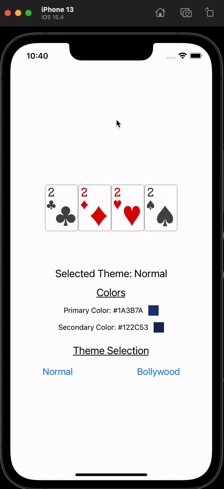

## Theming in React Native

Recently, we decided to introduce theming to enhance our user's gaming experience.
It was an exciting feature that brought the developers and designers together to brainstorm
the range of themes we could offer. Rather than settling for a boring dark theme, which everyone does, we created our Bollywood and Nepali theme to go along with the dark theme (obviously).

And here's what we did.

Let's divide and conquer our feature into a more detailed list of requirements, then get it done.

- [Setup](#setup)
- [Define our theme](#define-our-theme)
- [Create theme context](#create-theme-context)
- [Download theme](#download-theme)

Let's get into building exactly that.

## Setup

Let's set up a react-native project by using `react-native-cli`.

1. Let's install react-native project template.

```
npx react-native init rn_theme
```

The last argument `rn_theme` is the name of our project

2. Let's start our project in ios

```
cd rn_theme/ios && pod install && cd ../ && yarn ios && yarn start
```

3. Simple `Hello World` in react-native

Let's remove all the lines in `App.js` file.

```Javascript
import React from 'react';
import { View, Text, SafeAreaView } from 'react-native';

export default function App() {
  return (
    <SafeAreaView>
      <View>
        <Text>Hello World</Text>
      </View>
    </SafeAreaView>
  );
}
```

## Define our theme

The definition of a theme depends upon the requirements. It may include images, colors, fonts etc.
For our application and simplicity, we will resort to using only images and colors.
Let's create an assets folder and define our theme inside it.

```Javascript
/assets/index.js

export const theme = {
  '2S': require('./2S.png'),
  '2D': require('./2D.png'),
  '2H': require('./2H.png'),
  '2C': require('./2C.png'),
  primary: '#1A3B7A',
  secondary: '#122C53',
}
```

## Basic usage of theme

Let's use the theme defined in our App.js file

```Javascript
/App.js

import React from 'react';
import { View, Text, SafeAreaView, StyleSheet, Image } from 'react-native';

import { theme } from './assets';

const styles = StyleSheet.create({
  container: {
    justifyContent: 'center',
    height: '100%',
    width: '100%',
  },
  cardImageContainer: {
    flexDirection: 'row',
    justifyContent: 'center',
    alignItems: 'center',
    height: '30%',
  },
  cardImage: {
    width: 64,
    height: 90,
  },
  heading: {
    fontSize: 20,
    color: 'black',
    textDecorationLine: 'underline',
  },
  colorsTextContainer: {
    height: '15%',
    justifyContent: 'space-evenly',
    alignItems: 'center',
  },
  textContainer: {
    flexDirection: 'row',
    height: 20,
    alignItems: 'center',
  },
  themeView: {
    height: '100%',
    width: 20,
    marginLeft: 10,
  },
});

export default function App() {
  return (
    <SafeAreaView>
      <View style={styles.container}>
        <View style={styles.cardImageContainer}>
          <ThemedCardImage cardId="2C" />
          <ThemedCardImage cardId="2D" />
          <ThemedCardImage cardId="2H" />
          <ThemedCardImage cardId="2S" />
        </View>

        <View style={styles.colorsTextContainer}>
          <Text style={styles.heading}>Colors</Text>
          <ThemedTextColorBox colorId="primary" />
          <ThemedTextColorBox colorId="secondary" />
        </View>
      </View>
    </SafeAreaView>
  );
}


function ThemedCardImage({ cardId }) {
  return <Image source={theme[cardId]} style={styles.cardImage} />;
}

function ThemedTextColorBox({ colorId }) {
  return (
    <View style={styles.textContainer}>
      <Text style={{ textTransform: 'capitalize' }}>
        {colorId} Color: {theme.primary}
      </Text>
      <View
        style={[
          styles.themeView,
          {
            backgroundColor: theme.primary,
          },
        ]}
      />
    </View>
  );
}

```

Our app would look like this


## Create theme context

- In our next step, we will use `context` to store the theme. `context` in React is a global variable to share data across any of the components which are described within that given context.

```Javascript
/theme.context.js

import React, { createContext, useContext, useState } from 'react';
import { theme } from './assets';

const ThemeContext = createContext(null);

export function ThemeProvider({ children }) {
  const [loadedTheme, setLoadedTheme] = useState(theme);

  return (
    <ThemeContext.Provider value={{ theme: loadedTheme, setTheme: setLoadedTheme }}>
      {children}
    </ThemeContext.Provider>
  );
}

export function useTheme() {
  const ctx = useContext(ThemeContext);
  if (ctx === null) throw new Error('Did you wrap your component with ThemeProvider');
  return ctx.theme;
}

export function useUpdaterTheme() {
  const ctx = useContext(ThemeContext);

  if (ctx === null) throw new Error('Did you wrap your component with ThemeProvider');

  return ctx.setTheme;
}
```

- After describing the theme, we shall use it in our application

Let's wrap our application with `ThemeProvider` which would enable the theme to be used in all of our components

```Javascript
/index.js

import React from 'react';
import { AppRegistry } from 'react-native';
import App from './App';
import { name as appName } from './app.json';
import { ThemeProvider } from './theme.context';

AppRegistry.registerComponent(appName, () => Main);

function Main() {
  return (
    <ThemeProvider>
      <App />
    </ThemeProvider>
  );
}

```

- We could use theme via `useTheme` function inside our components

```Javascript
/App.js

function ThemedCardImage({ cardId }) {
  const theme = useTheme();

  return <Image source={theme[cardId]} style={styles.cardImage} />;
}

function ThemedTextColorBox({ colorId }) {
  const theme = useTheme();
  const color = theme[colorId];

  return (
    <View style={styles.textContainer}>
      <Text style={{ textTransform: 'capitalize' }}>
        {colorId} Color: {color}
      </Text>
      <View
        style={[
          styles.themeView,
          {
            backgroundColor: color,
          },
        ]}
      />
    </View>
  );
}
```

## Download theme

- Now, comes the most exciting part. We need to download and use the theme in our app based on user preferences.
  For that, we would need `react-native-fs` and `react-native-zip-archive`.

1. [react-native-fs](https://github.com/itinance/react-native-fs/) : helps us to download and store/read the theme from the filesystem.
2. [react-native-zip-archive](https://github.com/mockingbot/react-native-zip-archive) : helps us to unzip the downloaded theme assets.

Let's install both of the packages and get it rolling!

```
yarn add react-native-fs react-native-zip-archive
cd ios && pod install
cd ../ && yarn ios
```

- Downloading the theme

1. We download the zip file which contains all the assets and a manifest file.
2. We unzip the file and store the contents of the file in the file system.
3. We read from the manifest file and load all our assets

The content of the file looks like this

```
├── assets
│ ├── 2C.png
│ ├── 2D.png
│ ├── 2H.png
│ └── 2S.png
└── manifest.json
```

> Let's write the code to download, unzip and store the theme assets.

```Javascript
/theme.downloader.js

import RNFS from 'react-native-fs';
import { unzip } from 'react-native-zip-archive';

const ZIP_DOWNLOAD_PATH = `${RNFS.TemporaryDirectoryPath}/theme.zip`;
const THEME_ASSET_UNZIPPED_PATH = `${RNFS.DocumentDirectoryPath}/theme`;

export async function downloadAndStoreTheme(link) {
  try {
    /**  download the zip file which contains all the theme information */
    await RNFS.downloadFile({
      fromUrl: link,
      toFile: ZIP_DOWNLOAD_PATH,
      begin: () => {},
      background: true,
      progressInterval: 0,
      progress: ({ bytesWritten, contentLength, jobId }) => {
        const downloadProgress = Math.floor((bytesWritten / contentLength) * 100);
        console.log(downloadProgress);
      },
    }).promise;

    /** create the folder where we keep all our unzipped assets */
    await RNFS.mkdir(THEME_ASSET_UNZIPPED_PATH);

    /** unzip it, extract and store all the assets */
    await unzip(ZIP_DOWNLOAD_PATH, THEME_ASSET_UNZIPPED_PATH);
  } catch (err) {
    console.log('this is the erro', err.message);
    throw new Error(err.message);
  } finally {
    /** when everything is done, delete the zip file  */
    RNFS.unlink(ZIP_DOWNLOAD_PATH);
  }
}
```

> And we could use the function inside our application. All we need is the download link.

```Javascript
/app.js

import { loadTheme, downloadAndStoreTheme } from './theme.downloader';

async function downloadTheme() {
  await downloadAndStoreTheme(THEME_DOWNLOAD_LINK);
}
```

> After downloading the assets, we read the manifest and load the theme assets from it.

The content of our manifest file looks like this

```JSON
{
  "name": "Bollywood",
  "version": "1.0.0",
  "assets": {
    "primary": "#723C29",
    "secondary": "#4A2B1F",
    "2S": "/assets/2S.png",
    "2H": "/assets/2H.png",
    "2C": "/assets/2C.png",
    "2D": "/assets/2D.png"
  }
}
```

> There are couple of reasons behind using manifest file.

1. The definition of the theme is contained in this file. We could describe the version of our theme, in the case of any compatibility issues.
2. We define all our assets and path on it which makes it easy to just use `assets` property directly while loading the theme.

- Loading the theme

```Javascript
/theme.downloader.js

export async function loadTheme(id) {
  try {
    /** get the selected theme directory from the folder */
    const selectedThemeDir = await RNFS.readDir(THEME_ASSET_UNZIPPED_PATH).find(p => p.name === id);

    /** extract the manifest content file and read the assets paths */
    const content = await RNFS.readFile(selectedThemeDir.path + '/manifest.json');
    const { assets } = JSON.parse(content);

    /** resolve the asset path directory with respect to its folder */
    return resolveAssetPath(assets, selectedThemeDir.path);
  } catch (err) {
    throw new Error(err.message);
  }
}

/**
 * resolves the path of the assets with respect to the directory structure
 * converts
 * {
 *   "2S": "/assets/2S.png",
 * }
 * to
 * {
 *  "2S": "file://{RN_DOCUMENT_PATH}/theme/assets/2S.png",
 * }
 */
function resolveAssetPath(assetsDict, dirPrefix) {
  const resolved = {};

  function resolve(asset) {
    /** only resolve paths */
    if (asset.startsWith('/') || asset.startsWith('./')) {
      return 'file://' + dirPrefix + asset;
    }

    return asset;
  }

  for (const assetKey in assetsDict) {
    const asset = assetsDict[assetKey];

    if (Array.isArray(asset)) {
      resolved[assetKey] = asset.map(resolve);
    } else if (typeof asset === 'object') {
      resolved[assetKey] = resolveAssetPath(asset, dirPrefix);
    } else {
      resolved[assetKey] = resolve(asset);
    }
  }

  return resolved;
}
```

The output will now look like this



In our app, the process looks like this


