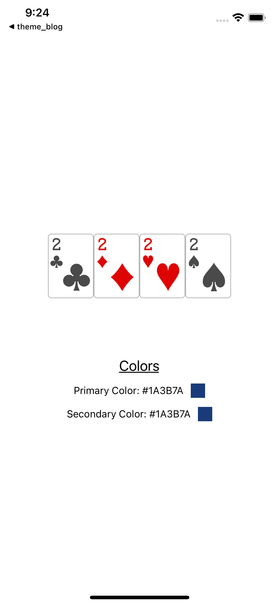

## Theming in React Native

Recently, we decided to introduce theming to enhance our user's gaming experience.
It was an exciting feature that brought the developers and designers together to brainstorm
the range of themes we could offer. Rather than settling for a boring dark theme, which everyone does, we created our Bollywood and Nepali theme to go along with the dark theme (obviously).

And here's what we did.

Let's divide and conquer our feature into a more detailed list of requirements, then get it done.

- Define a theme within our app.
- Download, save and apply the theme online.
- Persist the saved theme upon app launch

Let's get into building exactly that.

## The setup

Let's set up a react-native project by using `react-native-cli`.

1. Let's install react-native project template.

```
npx react-native init rn_theme
```

The last argument `rn_theme` is the name of our project

2. Let's start our project in ios

```
cd rn_theme/ios && pod install && cd ../ && yarn ios && yarn start
```

3. Simple `Hello World` in react-native

Let's remove all the lines in `App.js` file.

```Javascript
import React from 'react';
import { View, Text, SafeAreaView } from 'react-native';

export default function App() {
  return (
    <SafeAreaView>
      <View>
        <Text>Hello World</Text>
      </View>
    </SafeAreaView>
  );
}
```

## Define our theme

The definition of a theme depends upon the requirements. It may include images, colors, fonts etc.
For our application and simplicity, we will resort to using only images and colors.
Let's create an assets folder and define our theme inside it.

```Javascript
/assets/index.js

export const theme = {
  '2S': require('./2S.png'),
  '2D': require('./2D.png'),
  '2H': require('./2H.png'),
  '2C': require('./2C.png'),
  primary: '#1A3B7A',
  secondary: '#122C53',
}
```

## Basic usage of theme

Let's use the theme defined in our App.js file

```Javascript
/App.js

import React from 'react';
import { View, Text, SafeAreaView, StyleSheet, Image } from 'react-native';

import { theme } from './assets';

const styles = StyleSheet.create({
  container: {
    justifyContent: 'center',
    height: '100%',
    width: '100%',
  },
  cardImageContainer: {
    flexDirection: 'row',
    justifyContent: 'center',
    alignItems: 'center',
    height: '30%',
  },
  cardImage: {
    width: 64,
    height: 90,
  },
  heading: {
    fontSize: 20,
    color: 'black',
    textDecorationLine: 'underline',
  },
  colorsTextContainer: {
    height: '15%',
    justifyContent: 'space-evenly',
    alignItems: 'center',
  },
  textContainer: {
    flexDirection: 'row',
    height: 20,
    alignItems: 'center',
  },
  themeView: {
    height: '100%',
    width: 20,
    marginLeft: 10,
  },
});

export default function App() {
  return (
    <SafeAreaView>
      <View style={styles.container}>
        <View style={styles.cardImageContainer}>
          <CardImage cardId="2C" />
          <CardImage cardId="2D" />
          <CardImage cardId="2H" />
          <CardImage cardId="2S" />
        </View>

        <View style={styles.colorsTextContainer}>
          <Text style={styles.heading}>Colors</Text>
          <TextColorBox colorId="primary" />
          <TextColorBox colorId="secondary" />
        </View>
      </View>
    </SafeAreaView>
  );
}

function CardImage({ cardId }) {
  return <Image source={theme[cardId]} style={styles.cardImage} />;
}

function TextColorBox({ colorId }) {
  return (
    <View style={styles.textContainer}>
      <Text style={{ textTransform: 'capitalize' }}>
        {colorId} Color: {theme.primary}
      </Text>
      <View
        style={[
          styles.themeView,
          {
            backgroundColor: theme.primary,
          },
        ]}
      />
    </View>
  );
}

```

Our app would look like this


